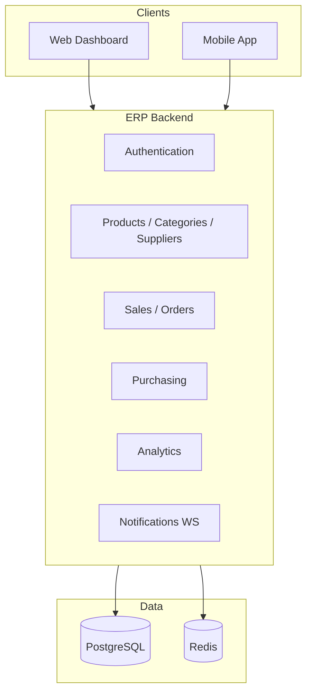

# Store Management Platform — Implementation Plan

This plan is based on **ERP-System-Backend** (NestJS 11, PostgreSQL/Prisma, Redis, JWT, Socket.IO). The backend already covers **catalog, suppliers, discounts, users, and auth**. The Prisma schema already models **orders, sales/purchase invoices, expenses, and loyalty** — but those have **no REST APIs yet**. There is no web or mobile client in this repo.

---

## Product vision

| Surface           | Primary users                         | Core jobs                                                         |
| ----------------- | ------------------------------------- | ----------------------------------------------------------------- |
| **Web dashboard** | Admin, Manager, Employee              | Run the store: inventory, POS, purchases, reports, staff          |
| **Mobile app**    | Employee (floor), Customer (optional) | Quick stock checks, POS, order status; browse/order for customers |
| **Backend API**   | Both clients                          | Single source of truth, RBAC, realtime alerts                     |



---

## Current backend status

### Implemented REST APIs

| Module             | Base path         | Notes                                                        |
| ------------------ | ----------------- | ------------------------------------------------------------ |
| **authentication** | `/authentication` | Role-specific sign-in/up, verify email, refresh, sign-out    |
| **user**           | `/user`           | Profiles, list users, archive/delete, admin/employee updates |
| **customer**       | `/customer`       | `GET/PATCH me` only                                          |
| **product**        | `/product`        | CRUD, search, by category/supplier, low-stock, stock patch   |
| **category**       | `/category`       | CRUD + list/search                                           |
| **supplier**       | `/supplier`       | CRUD; blocks delete if products/invoices linked              |
| **discount**       | `/discount`       | CRUD, toggle, calculate, best discount, active list          |
| **attachment**     | `/attachment`     | Public upload; authenticated download                        |

### In Prisma schema but no Nest module/API yet

| Domain          | Models                                       |
| --------------- | -------------------------------------------- |
| **Sales / POS** | `SalesInvoice`, `SaleItem`                   |
| **Purchasing**  | `PurchaseInvoice`, `PurchaseItem`            |
| **Orders**      | `Order`, `OrderItem`                         |
| **Finance**     | `Expense`                                    |
| **Loyalty**     | `LoyaltyReward` (+ `Customer.loyaltyPoints`) |
| **Audit**       | `AuditLog`                                   |

---

## Phase 0 — Foundation (1–2 weeks)

**Goal:** Stable API contract and shared client setup before feature work.

### Backend (this repo)

| Task                           | Why                                                                                                                |
| ------------------------------ | ------------------------------------------------------------------------------------------------------------------ |
| Commit/align Prisma migrations | Schema exists; migrations folder may be missing                                                                    |
| Mount Swagger in `main.ts`     | Document APIs for web/mobile teams                                                                                 |
| Add global prefix `/api/v1`    | Versioning for future breaking changes                                                                             |
| Tighten RBAC                   | Add permissions for orders, invoices, expenses, reports; fix product update (`@setPermissions()` empty = any user) |
| Enforce role on sign-in        | Separate URLs exist but same `signIn()` — validate `user.role` matches route                                       |
| README + `.env` guide          | Onboarding for dashboard/mobile devs                                                                               |

### Clients (new repos or monorepo)

| Choice     | Recommendation                                          |
| ---------- | ------------------------------------------------------- |
| **Web**    | React + Vite (or Next.js if you need SSR/admin SEO)     |
| **Mobile** | React Native (Expo) — share types/API client with web   |
| **Shared** | OpenAPI-generated client or shared `api-client` package |

**Deliverable:** Auth flow end-to-end (signup → verify → signin → refresh) on web + mobile against existing `/authentication/*` endpoints.

---

## Phase 1 — Inventory & catalog (mostly done)

**Backend status:** Products, categories, suppliers, discounts, low-stock, manual stock patch.

### Web dashboard

- Product list (search, filters by category/supplier, low-stock badge)
- CRUD for products, categories, suppliers
- Discount management (create, toggle, preview calculation)
- Dashboard widget: **low-stock count**, **total SKUs**

### Mobile (employee)

- Barcode/SKU lookup → product detail + stock
- Quick stock adjustment (calls `PATCH /product/:id/stock`)
- Low-stock alerts list

### Backend gaps to close

| Module                                | Endpoints (suggested)                                       |
| ------------------------------------- | ----------------------------------------------------------- |
| **Inventory movements** (optional v2) | `StockMovement` model or audit on each sale/purchase        |
| **Customer admin**                    | `GET /customer`, loyalty adjust — today only `/customer/me` |

---

## Phase 2 — Sales & POS (highest business value)

**Schema:** `SalesInvoice`, `SaleItem` — **no API yet**.

### Backend — new `sales` module

```
POST   /sales/invoices          # Create sale (cart → invoice)
GET    /sales/invoices          # List (date, status, cashier)
GET    /sales/invoices/:id
PATCH  /sales/invoices/:id/status   # COMPLETED, CANCELLED, REFUNDED
```

**Business rules in service layer:**

- On `COMPLETED`: decrement `product.quantityInStock`, update `customer.totalSpent`, apply loyalty points
- Apply best discount (reuse existing `discount` service)
- Link `employee` as cashier (`processedInvoices`)
- Emit notification (low stock, large sale) via existing BullMQ + Socket.IO

### Web dashboard

- **POS screen:** search products, cart, payment method, complete sale
- **Sales history:** filters, receipt view, refund/cancel
- **Daily summary:** revenue, transaction count (simple aggregation)

### Mobile (employee)

- Lightweight POS (same APIs, touch-friendly cart)
- Offline queue (optional Phase 2b): cache cart locally, sync when online

---

## Phase 3 — Orders & fulfillment

**Schema:** `Order`, `OrderItem`, `OrderStatus` — **no API yet**.

### Backend — new `order` module

```
POST   /orders                    # Customer or staff creates order
GET    /orders                    # Staff: all; Customer: own
GET    /orders/:id
PATCH  /orders/:id/status         # PENDING → PREPARING → OUT_FOR_DELIVERY → DELIVERED
```

- Reserve or deduct stock on status transitions (define policy once)
- Realtime: push status updates via existing `/notifications` gateway

### Web dashboard

- Order queue (kanban or table by status)
- Assign/prepare/mark delivered
- Link order → sales invoice when paid (align with schema TODOs)

### Mobile

- **Staff:** order list, one-tap status updates
- **Customer (if in scope):** place order, track status, push notifications

---

## Phase 4 — Purchasing & suppliers

**Schema:** `PurchaseInvoice`, `PurchaseItem` — **no API yet**.

### Backend — new `purchase` module

```
POST   /purchase/invoices
GET    /purchase/invoices
PATCH  /purchase/invoices/:id/status
```

- On receive: increase stock, tie to `supplier`
- Reuse supplier delete guards (already checks linked invoices)

### Web dashboard

- Create purchase order from supplier catalog
- Receive goods → stock in
- Purchase history & supplier spend

### Mobile

- Receive shipment (scan items, confirm quantities) — optional

---

## Phase 5 — Finance & operations

**Schema:** `Expense` — **no API yet**.

### Backend

```
POST/GET/PATCH /expenses
GET /reports/summary?from=&to=
```

Reports (start simple, SQL/Prisma aggregates):

- Revenue (sales invoices)
- COGS proxy (purchase totals)
- Expenses
- Top products, sales by category
- Export CSV (you already have `json2csv`)

### Web dashboard

- Expense entry
- Reports page with date range + charts
- P&L-style summary (revenue − expenses; refine later)

### Mobile

- Read-only KPIs for manager (optional)

---

## Phase 6 — Customers, loyalty & staff

| Area             | Backend                                       | Web                      | Mobile               |
| ---------------- | --------------------------------------------- | ------------------------ | -------------------- |
| **Customer CRM** | List customers, order history, adjust loyalty | Customer detail page     | —                    |
| **Loyalty**      | `LoyaltyReward` CRUD, redeem points on sale   | Rewards config           | Customer wallet      |
| **Staff**        | Employee list, permissions review             | User management (exists) | Profile, shift tools |
| **Audit**        | `AuditLog` on sensitive mutations             | Admin audit viewer       | —                    |

Wire `PermissionsMap` so **EMPLOYEE** can run POS but not change catalog; **MANAGER** gets reports + discounts; **ADMIN** gets everything.

---

## Phase 7 — Polish & production

| Area              | Tasks                                                            |
| ----------------- | ---------------------------------------------------------------- |
| **Notifications** | REST for in-app notification history; role-targeted broadcasts   |
| **Attachments**   | Product images via existing `/attachment`                        |
| **Backups**       | Already cron `pg_dump` — document restore                        |
| **Testing**       | Fix stale e2e; add integration tests for sales/order stock rules |
| **Deploy**        | Compose (nginx + 3 replicas) is ready; add CI, env secrets       |
| **Mobile store**  | Expo EAS, push notifications (FCM/APNs) tied to order events     |

---

## Suggested build order

```
Phase 0  Foundation (API docs, RBAC, clients scaffold)
    ↓
Phase 1  Catalog UI (leverage existing APIs)
    ↓
Phase 2  Sales / POS  ← unlocks revenue tracking
    ↓
Phase 3  Orders
    ↓
Phase 4  Purchasing
    ↓
Phase 5  Reports & expenses
    ↓
Phase 6  Loyalty, CRM, audit
    ↓
Phase 7  Production hardening
```

---

## Role × feature matrix

| Feature       | Admin | Manager | Employee | Customer |
| ------------- | ----- | ------- | -------- | -------- |
| Catalog CRUD  | ✓     | read    | read     | —        |
| POS / sales   | ✓     | ✓       | ✓        | —        |
| Orders manage | ✓     | ✓       | ✓        | own only |
| Purchases     | ✓     | ✓       | —        | —        |
| Reports       | ✓     | ✓       | limited  | —        |
| Discounts     | ✓     | ✓       | —        | —        |
| User admin    | ✓     | —       | —        | —        |

---

## Technical decisions to make early

1. **Monorepo vs separate repos** for web + mobile + API
2. **Customer-facing mobile** in v1 or staff-only first
3. **Order vs invoice** — one checkout flow or separate (schema has both; Prisma TODOs mention this)
4. **Stock deduction** — on order create, on payment, or on invoice complete
5. **Payment integration** — cash-only MVP vs Stripe/etc. later

---

## What to start this week

### Backend (highest leverage)

1. `sales` module — implement `SalesInvoice` + stock/loyalty side effects
2. Permissions for sales/orders + fix product mutation guard
3. `GET /reports/dashboard` — counts: low stock, today’s sales, pending orders

### Web MVP screens

1. Login → dashboard home
2. Products + low stock
3. POS

### Mobile MVP

1. Auth + product lookup + stock patch

---

## Tech stack reference

| Layer              | Choice                                     |
| ------------------ | ------------------------------------------ |
| **Framework**      | NestJS 11                                  |
| **Database**       | PostgreSQL via Prisma 7                    |
| **Cache / queues** | Redis, BullMQ                              |
| **Auth**           | Custom JWT + Argon2                        |
| **Validation**     | Zod + nestjs-zod                           |
| **Realtime**       | Socket.IO (`/notifications`)               |
| **Roles**          | `ADMIN`, `EMPLOYEE`, `CUSTOMER`, `MANAGER` |
